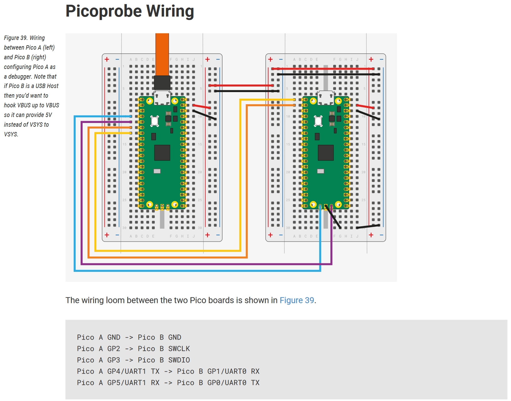

# cmsis-rp2040 (picopico)

Project template to facilitate CMSIS and the Pico-SDK relatively seamlessly.

[buildgen.ps1](buildgen.ps1) facilitates this. Using the Open-CMSIS devtools in
conjunction with a custom script, we can generate cmake files that include the
pico-sdk, along with anything else included by the CMSIS system.

## Dependencies

Base:

- powershell (5.10+): Powershell included with Windows should work fine here.
- internet access: build tools (arm gcc, cmake, ninja, ctools, openocd, etc...)
are pulled via [vcpkg](https://github.com/microsoft/vcpkg) artifacts. This should
remove the guess-work in downloading the right build tools.

Additional:

- clang tools (ie `clang-format`). [.clang-format](.clang-format) is your base for
this. `clangd` also comes in handy. These can be downloaded as part of `llvm`,
which can be downloaded using the [choco](https://chocolatey.org/) package manager,
though it could be obtained a variety of ways.
- (vscode): cortex-debug and ARM CMSIS csolution extension.

Build tools can be accessed without executing the build script itself using
[bootstrap.ps1](./bootstrap.ps1)- which only activates the vcpkg environment.

Alternatively:

- Quick bootstrap (powershell)

    ```ps1
    iex (iwr -useb https://aka.ms/vcpkg-init.ps1)
    vcpkg activate
    ```

- Via repo

    ```bash
    git clone https://github.com/Microsoft/vcpkg.git
    # ./vcpkg/bootstrap-vcpkg.bat # Windows
    ./vcpkg/bootstrap-vcpkg.sh # Shell script
    ```

### Visual Studio Code

In [.vscode](./.vscode/), some suitable defaults are provided. This means
build tasks which can be used without other additional dependencies- as your
project(s) in this template evolve, however, you may need to adjust these tasks,
as they dictate what the pico-sdk includes in the build.

The other build tasks, namely `picopico program`, `BUILDGEN & PROGRAM`, and the
`cortex-debug` launch tasks are intended to target a CMSIS-DAP debug probe for
programming. See section "picoprobe" for some information on this.
<!--
(TODO) As a convenience, a vscode extension pack is provided - which installs the
following extensions:

- ARM CMSIS csolutions
- clangd format
- cmake support
- TODO finish pack!!

-->

## Built-in demos

There are currently 2 demos available.

- [Blinking light demo (master)](https://github.com/cinnamondev/cmsis-rp2040) - Blink the on board LED.

- [LVGL demo (demo-lvgl)](https://github.com/cinnamondev/cmsis-rp2040/tree/demo-lvgl) - Using the CMSIS ecosystem, LVGL and perf_counter
can be used for a relatively seamless port of LVGL. This demo branch includes
drivers for the ILI9341 and XPT2040.

## Linux

Powershell is crossplatform - and as long as you can install it, the buildscript
itself should work. `vcpkg`, too, is crossplatform.

So far, I have ran into trouble getting everything set up perfectly.
`vcpkg` succeeds but ninja attempts to use tools from the wrong toolchain at
times, rather than using the just installed `arm-none-eabi-gcc` toolchain.
Hoping to work this out in time- this will remain TODO.

## picoprobe

There are many ways to debug the Pico. The 'standard' is via a CMSIS-DAP probe,
such as a J-Link. However, the Pi Foundation have their own firmware for the
Pico, called [picoprobe](https://github.com/raspberrypi/picoprobe), which can
turn a Pi Pico into a CMSIS-DAP debug probe with additional UART bridge. No more
BOOTSEL fiddling! This is possible using OpenOCD (included via vcpkg)- the Pi
Foundations build is no longer a neccesity these days.

Simply flash their firmware to a spare pico you have lying about, and you now
have a debug probe!



> The above is an exert from  "[Getting Started with Raspberry Pi Pico](https://datasheets.raspberrypi.com/pico/getting-started-with-pico.pdf)" datasheet - Page 64.<br><br>
The documentation of the RP2040 microcontroller is licensed under a [Creative Commons Attribution-NoDerivatives 4.0 International (CC BY-ND)](https://creativecommons.org/licenses/by-nd/4.0/).

Alternatively, the Pi Foundation also [make their own debug probe](https://www.raspberrypi.com/products/debug-probe/), which should function through the same means, but using
their standardised [Debug connector spec](https://datasheets.raspberrypi.com/debug/debug-connector-specification.pdf).

## Licensing

This template (i.e: the buildgen build script) is licensed under the [Apache 2.0
License](./LICENSE).

```text
   Copyright 2023 Cinnamondev

   Licensed under the Apache License, Version 2.0 (the "License");
   you may not use this file except in compliance with the License.
   You may obtain a copy of the License at

       http://www.apache.org/licenses/LICENSE-2.0

   Unless required by applicable law or agreed to in writing, software
   distributed under the License is distributed on an "AS IS" BASIS,
   WITHOUT WARRANTIES OR CONDITIONS OF ANY KIND, either express or implied.
   See the License for the specific language governing permissions and
   limitations under the License.
```

## In the future

- Arm Compiler configuration
- Linux fix
- .clangd
- vscode extension pack
